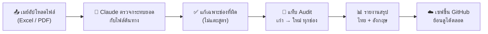

# 🏨 Mae's Workspace — ระบบกระทบยอดรายได้โรงแรม

**พื้นที่ทำงาน Claude Code สำหรับงาน Excel ประจำเดือนของโรงแรมในเครือ Mitsui Thailand**

เมย์อัปโหลดไฟล์ → Claude ตรวจกระทบยอดกับไฟล์ต้นทาง → ได้ไฟล์ที่แก้แล้วพร้อม
บันทึกทุกการเปลี่ยนแปลง (audit trail) และรายงานสรุปแบบเข้าใจง่าย —
ทุกงานถูกเก็บไว้ใน GitHub ครบถ้วน ย้อนดูได้เสมอว่าแก้อะไร เมื่อไหร่ เพราะอะไร

> 💬 พิมพ์คุยกับ Claude เป็นภาษาไทยหรืออังกฤษก็ได้ ไม่ต้องรู้เรื่องเทคนิคเลยค่ะ
> เริ่มจากพิมพ์ `/guide` ได้ทุกเมื่อ

---

## 🏢 โรงแรมในพอร์ตโฟลิโอ

| รหัส | โรงแรม | ที่ตั้ง |
|---|---|---|
| **SR9** | Somerset Rama 9 | กรุงเทพฯ |
| **AES** | Ascott Embassy Sathorn | กรุงเทพฯ |
| **LYF / LS8** | lyf Sukhumvit 8 | กรุงเทพฯ |
| **SP** | Somerset Pattaya | พัทยา |

---

## ⌨️ คำสั่งลัด (พิมพ์ใน Claude Code ได้เลย)

| คำสั่ง | ทำอะไร |
|---|---|
| `/guide` | 📖 เมนูแนะนำทุกอย่างที่ workspace นี้ทำได้ |
| `/reconcile-ls8` | ✏️ แก้ไฟล์ Half-year ให้ตรงกับ LS8 + แท็บ audit + รายงาน + เซฟขึ้น GitHub |
| `/check-ls8` | 🔍 ตรวจอย่างเดียว — แสดงรายการตัวเลขที่ไม่ตรง ไม่แก้ไฟล์ |
| `/audit-report` | 📊 สร้าง/เปิดรายงานสรุปการแก้ไขล่าสุด (ไทย+อังกฤษ) |
| `/status` | 📋 ดูสถานะ: งานที่ค้าง ไฟล์ล่าสุด การตัดสินใจล่าสุด |
| `/sync` | ☁️ เซฟทุกอย่างขึ้น GitHub ให้เครื่องอื่นเห็นด้วย |
| `/new-task` · `/task-done` | 🗂️ เปิด/ปิดงานแบบมีบันทึกติดตาม (ส่วนใหญ่ Claude ทำให้อัตโนมัติ) |
| `/log-decision` | 🧠 จดการตัดสินใจไว้ให้ Claude จำได้ทุก session |

💡 **เคล็ดลับ:** ไฟล์ที่อัปโหลดจะเข้ามาในระบบเอง ไม่ต้องบอกว่าอยู่ที่ไหน
และจะพิมพ์อธิบายสิ่งที่ต้องการเป็นคำพูดธรรมดาแทนคำสั่งก็ได้เสมอ

---

## 🔄 งานเดินยังไง



ทุกการแก้ไขอัตโนมัติจะมีแท็บ **"Recon …"** อยู่ในไฟล์ Excel ที่ส่งมอบ
แสดงค่าก่อนแก้/หลังแก้ครบทุกช่อง พร้อมหมายเหตุว่าอะไรที่ตั้งใจไม่แตะ

---

## 📁 โครงสร้างโฟลเดอร์

```
data/source/     ไฟล์ Excel ต้นฉบับที่อัปโหลด (อ่านอย่างเดียว — ห้ามแก้ทับ)
data/pdf/        ไฟล์ PDF ต้นฉบับ เช่น History & Forecast (อ่านอย่างเดียว)
output/          ไฟล์ส่งมอบ: workbook ที่กระทบยอดแล้ว + รายงาน HTML
scripts/         เครื่องมือ Python (openpyxl) — หนึ่งสคริปต์ต่อหนึ่งงานประจำ
docs/decisions/  บันทึกการตัดสินใจ — หนึ่งไฟล์ต่อหนึ่งเรื่องที่เมย์เคาะ
tasks/           การติดตามงาน — งานที่เปิดอยู่ และงานที่จบแล้วพร้อมผลลัพธ์
WORKLOG.md       บันทึกว่าแต่ละ session ทำอะไรไป (ใหม่สุดอยู่บน)
CLAUDE.md        คู่มือของ Claude: ขั้นตอนงาน, ตาราง mapping, กฎทั้งหมด
README.md        ไฟล์นี้
.claude/         คำสั่งลัด, skills, และ hooks ที่บังคับกฎ
resources/       คลังอ้างอิง (ไม่เก็บใน git — ระบบโหลดกลับมาให้เอง)
```

---

## 🧰 งานประจำที่ workspace นี้ทำได้

| งาน | ทำอะไร |
|---|---|
| **กระทบยอด Half-year กับ LS8** | แก้แท็บ LYF ในไฟล์ Segment Half-year ให้ตรงกับไฟล์ LS8 (ต้นทางที่ถูกต้อง) |
| **กระทบยอด SR9 / AES / SP** | แบบเดียวกัน จากไฟล์ Market Segment / Market Mix ของแต่ละโรงแรม |
| **Mapping รายเดือน (MMR SR9)** | เพิ่มคอลัมน์เดือนใหม่ในชีต mapping จากตัวเลข USALI P&L พร้อมตรวจ check column |
| **ตรวจผลต่างเดือนต่อเดือน** | คำนวณ Dif, ติดธงรายการที่เกินเกณฑ์ (LYF ±20k / อื่น ±50k), แปลงโน้ตเป็นคำถาม |
| **Pick Up Pace** | กรอก Net Room Sold / ADR จาก PDF History & Forecast ลงชีต Pick Up Pace |
| **Forecast booking pace** | กรอกยอดจองเดือนถัดไปจาก PDF snapshot ระหว่างเดือน |
| **สัญชาติ (Nationality)** | เติมบล็อก RN/ADR by Nationality — เลือก 10 สัญชาติหลักจากไฟล์รายเดือน |
| **รายงาน/สไลด์ผู้บริหาร** | สร้าง PowerPoint และรายงาน HTML จาก workbook ที่ตรวจแล้ว |

---

## 🔒 กฎเหล็กของ workspace (มีระบบบังคับจริง ไม่ใช่แค่ขอความร่วมมือ)

ระบบ **hooks** (โปรแกรมเล็ก ๆ ใน `.claude/hooks/`) คอยบังคับกฎเหล่านี้
โดย Claude ข้ามไม่ได้:

- 🚫 **ห้ามแก้ไฟล์ต้นฉบับ** — ทุกไฟล์ใน `data/` แตะไม่ได้ ต้องทำงานบนสำเนาใน `output/` เท่านั้น
- 🌿 **branch เดียวคือ `main`** — ห้ามสร้าง branch ใหม่, ห้าม force-push ประวัติ
- 💾 **commit ก่อนเริ่มงานใหม่เสมอ** — ถ้ามีงานค้าง ระบบ commit ให้อัตโนมัติ
- 🏁 **จบ session ไม่ได้ถ้ายังไม่เซฟ** — งานทุกชิ้นต้อง commit + push + จด WORKLOG ก่อน
- 📑 **ทุกการแก้ไขต้องมี audit trail** — แท็บ audit ในไฟล์ + รายงานเก็บใน repo

## 🧠 ความจำที่อยู่ข้าม session

session ของ Claude เริ่มใหม่ทุกครั้ง แต่ workspace นี้จำทุกอย่างแทน:

- **`WORKLOG.md`** — ไดอารี่ของงาน: session ไหนทำอะไร ไฟล์ไหนถูกแตะ
- **`docs/decisions/`** — คำตัดสินของเมย์ (เช่น "ห้ามแตะแท็บ Summary", "ยึด result sheets เป็นหลัก") — Claude ต้องอ่านก่อนถามซ้ำ
- **`tasks/`** — งานที่เปิดค้างจะถูกประกาศทุกครั้งที่เปิด session ใหม่ จนกว่าจะปิดงาน
- เปิด session ใหม่ทุกครั้ง ระบบจะดึงงานล่าสุดจาก GitHub มาให้เอง

---

## 🛠️ สำหรับสายเทคนิค

สคริปต์ใช้ Python 3 + `openpyxl` (ติดตั้งอัตโนมัติตอนเปิด session)
ตัวอย่าง — กระทบยอด Half-year กับ LS8:

```bash
python3 scripts/reconcile_ls8.py \
    --ls8 "data/source/<ไฟล์ LS8>.xlsx" \
    --halfyear "data/source/<ไฟล์ Half-year>.xlsx" \
    --out "output/<ไฟล์ Half-year>_LS8-reconciled.xlsx"   # เติม --dry-run = ตรวจอย่างเดียว

python3 scripts/audit_report.py "output/<ไฟล์ที่กระทบยอดแล้ว>.xlsx"   # สร้างรายงาน HTML
```

ทุกสคริปต์จะตรวจโครงสร้างไฟล์ (assert layout) ก่อนเขียน, แก้เฉพาะช่องค่าคงที่
(ไม่แตะสูตร), และต่อท้ายแท็บ audit เสมอ

| Hook | จังหวะทำงาน | หน้าที่ |
|---|---|---|
| `protect_paths.py` | ก่อนแก้ไฟล์ | บล็อกการแก้ `data/source/`, `data/pdf/`, `resources/` |
| `guard_bash.py` | ก่อนรันคำสั่ง | บล็อกการสร้าง branch, force-push, ลบ/เขียนทับไฟล์ต้นฉบับ |
| `checkpoint.py` | เมื่อได้รับงานใหม่ | auto-commit งานที่ค้างอยู่ |
| `finish_guard.py` | ก่อนจบ turn | ไม่ให้จบถ้ายังมีงานไม่ commit/push หรือยังไม่จด WORKLOG |
| `git_session_sync.py` | เปิด session | fetch + fast-forward จาก `origin/main` |
| `session_status.sh` | เปิด session | แจ้ง branch, งานค้าง, การตัดสินใจล่าสุด |

รายละเอียดฉบับเต็ม — ขั้นตอนงานแต่ละชนิด, ตาราง mapping segment,
checklist การตรวจสอบ, และกฎทั้งหมด — อยู่ใน [CLAUDE.md](CLAUDE.md)

---

*Workspace นี้ดูแลโดย Claude Code — เริ่มใช้งานได้เลยด้วยการพิมพ์ `/guide` ค่ะ* 🌸
